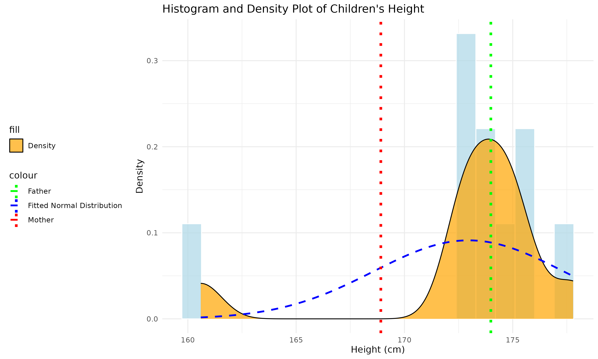
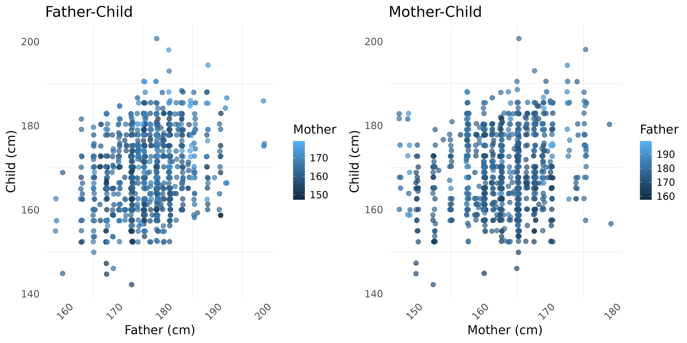
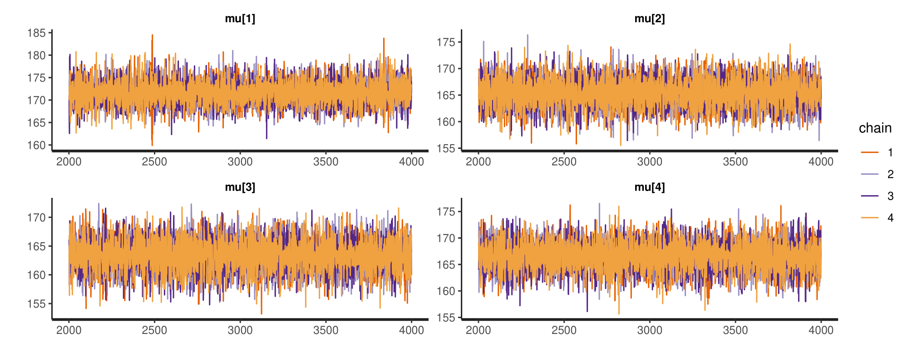
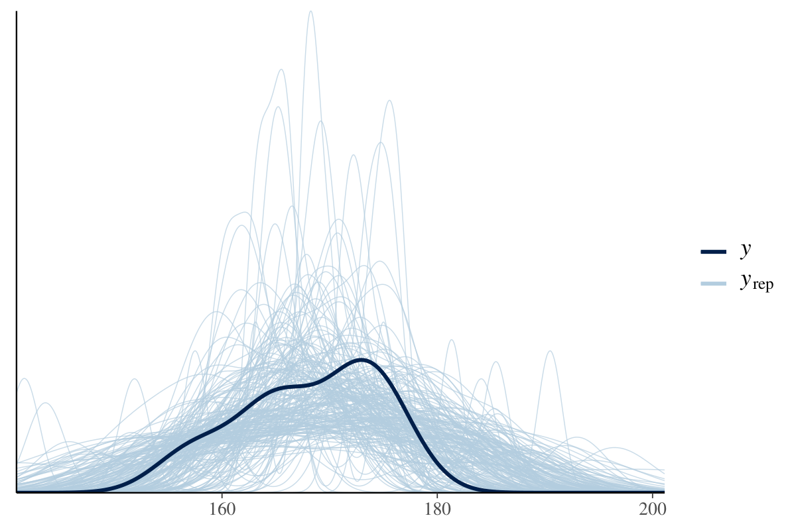

# Fully-Bayesian data analysis of heights' distribution in families

This project presents a comprehensive Bayesian analysis of the distribution of children's heights in families, focusing on the influence of parents' heights. Utilizing Galton's classic data, it introduces various models, including pooled, hierarchical, and hierarchical models with parental prior mean, to study height distributions. 

The analysis incorporates Bayesian statistical methods to explore familial height dynamics, emphasizing understanding the genetic and environmental factors that contribute to height variation within families.

## Features

- Implementation of Bayesian models to analyze children's height distribution in families.

- Application of pooled, hierarchical, and hierarchical models with parental prior mean.
- Detailed data preprocessing and exploration using Galton's height data.

    
    

- Utilization of Stan for Bayesian inference and model simulations.

- Comprehensive convergence diagnostics and posterior predictive checks.
- Visual and quantitative comparisons of model predictions with actual data.

    
    

